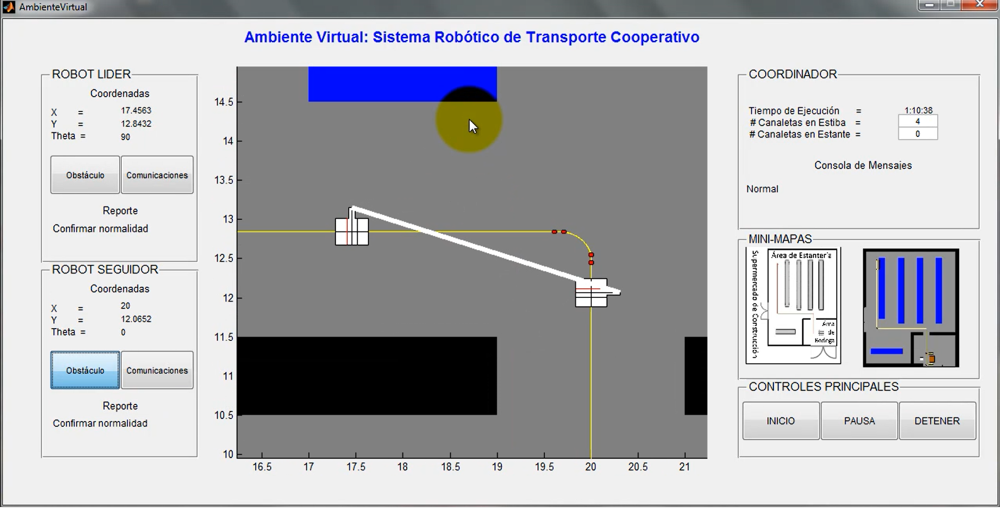

# Cooperative-robotics-simulation

This project is the result of my undergraduate thesis in Mechatronics Engineering. Developed in MATLAB, it simulates an algorithm to coordinate motion of two robots transporting gutters inside a warehouse.

The source files in this project are registered on my behalf at Unversidad Militar Nueva Granada, and are thus confidential and for demonstration purposes only. Please refer to the [license](./LICENSE) for more details.

The [media](./media) folder contains video recordings of the simulation. 

To interact with the simulation, you must install MATLAB and perform the following steps:

1. Download the [src](./src) folder.
2. Open MATLAB and navigate to the location where the folder was downloaded.
3. Start the simulation by typing `run(AmbienteVirtual)` in the "Command Window" or by double-clicking AmbienteVirtual.m in the left-side navigation pane.
